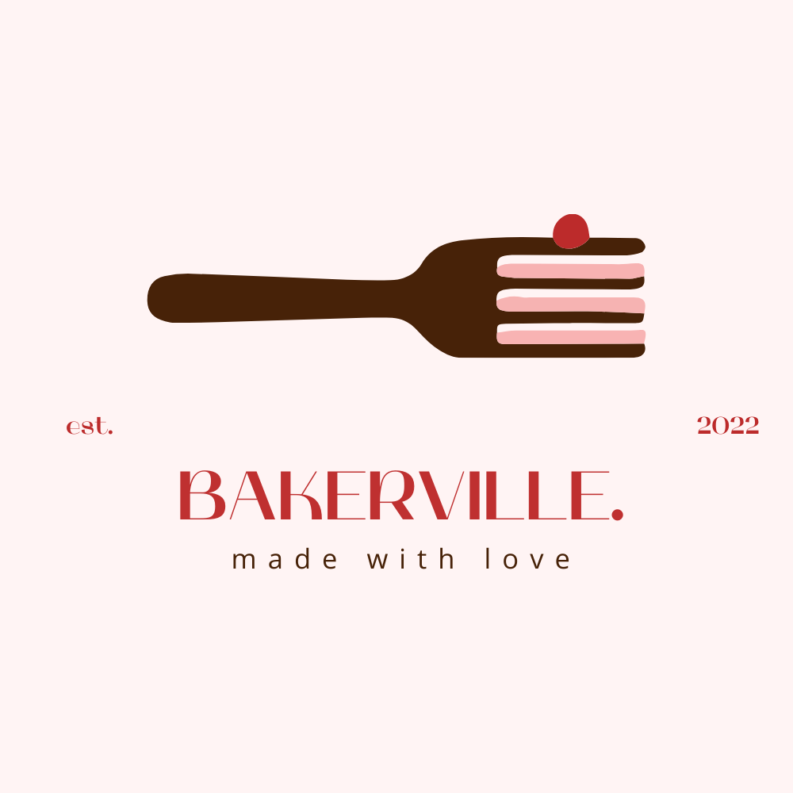
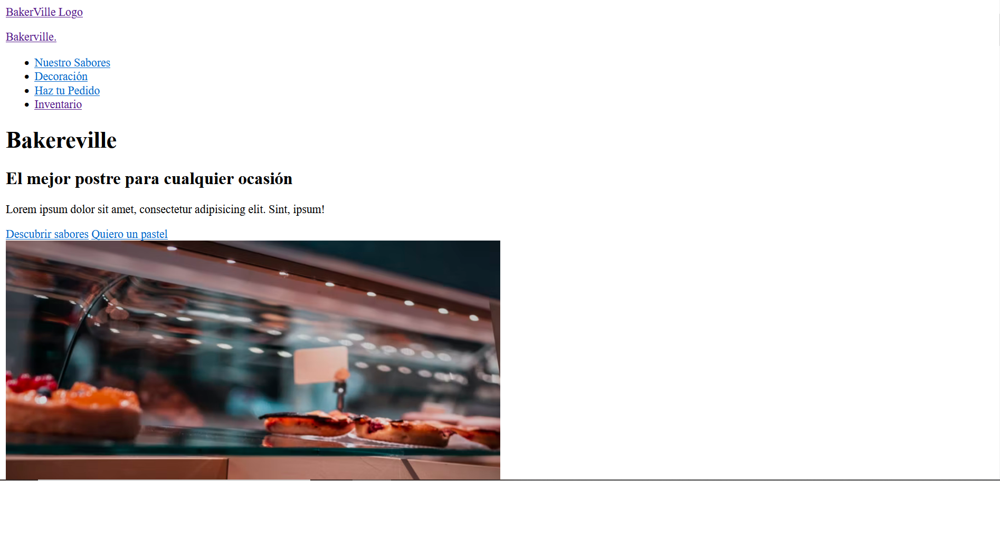
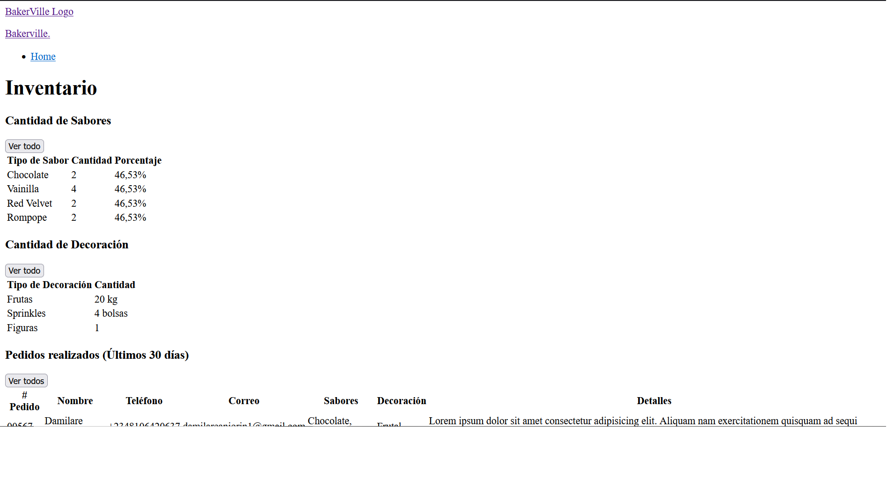
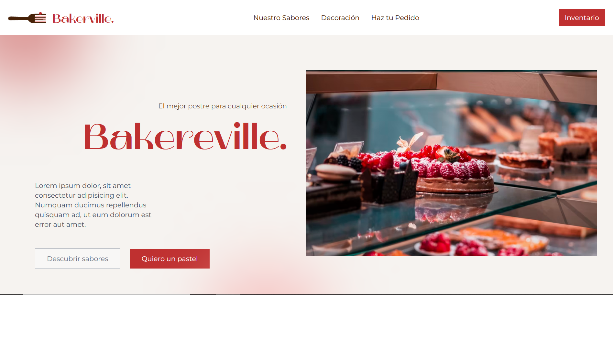
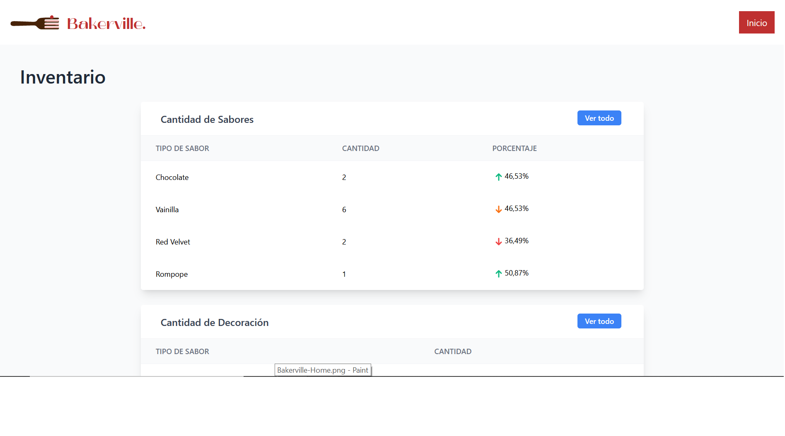

# Launch-X FrontEnd Mission | Semana 2 - Primer vuelo 🛸 Práctica HTML 🦴

## **Índice**

1. [Caso: Pastelería 🍰](https://github.com/FedericoCadena9/LaunchX-Semana2#caso-pasteleria-)
2. [Toma de Requerimientos 🔎](https://github.com/FedericoCadena9/LaunchX-Semana2#toma-de-requerimientos-)
3. [Marca y Logo 📐](https://github.com/FedericoCadena9/LaunchX-Semana2#marca-y-logo-)
4. [Maquetación de Pastelería 📃]()
5. [Diseño de la Pastelería 🎨]()

 

## **Caso: Pastelería 🍰**

Descripción: Se requiere en una pastelería tener presencia en Internet a base de crear una página web dónde los usuarios puedan pedir pasteles. Además el pastelero deberá de ver la información de ciertos insumos, así como los pedidos de sus clientes. 

## **Toma de Requerimientos 🔎**

En base a los requerimientos funcionales propuestos por el cliente se pueden encontrar los más destacables:

- El cliente de la pastelería necesita ver los diferentes sabores de pasteles, así como los precios de cada uno.
- El cliente de la pastelería necesita ver los diferentes adornos con los que se puede decorar el pastel y los precios de cada uno.
- El cliente de la pastelería tendrá la posibilidad de combinar sabores dependiendo de sus preferencias.
- El cliente de la pastelería tendrá la posibilidad de combinar adornos dependiendo de sus preferencias.
- El cliente de la pastelería necesita poner en un formulario su pedido.
- El formulario debe de contener los datos de contacto del cliente que son Nombre, Teléfono, Correo Electrónico, Descripción general del pastel y la selección de sabores y adornos.
- El pastelero necesita tener la información de la cantidad de sabores que le quedan para hacer los pasteles.
- El pastelero necesita tener la información de la cantidad de adornos que le quedan para hacer los pasteles.
- El pastelero necesita una tabla donde aparezcan los pedidos que se han realizado con los datos del formulario.
- La página debe tener información de la pastelería que es Dirección, Teléfono y horarios de atención.

## **Marca y Logo 📐**

## **Maquetación de Pastelería 📃**

> Consulta la página maquetada en HTML desde el siguiente [link](https://html-bakerville.vercel.app/).

## **Maquetación de Inventario 📈**

> Consulta la página maquetada en HTML desde el siguiente [link](https://html-bakerville.vercel.app/inventario.html).

 

## **Diseño de la Pastelería 🎨**

> Consulta la página desde el siguiente [link](https://bakerville.vercel.app/).

## **Diseño del Inventario 🎨**

> Consulta la página desde el siguiente [link](https://bakerville.vercel.app/inventario.html).

 
Entregables desarrollados con base a los contenidos de la Semana 2 - Primer vuelo 🛸| Frontend Mission del programa Launch X - Innovacción Virtual.

